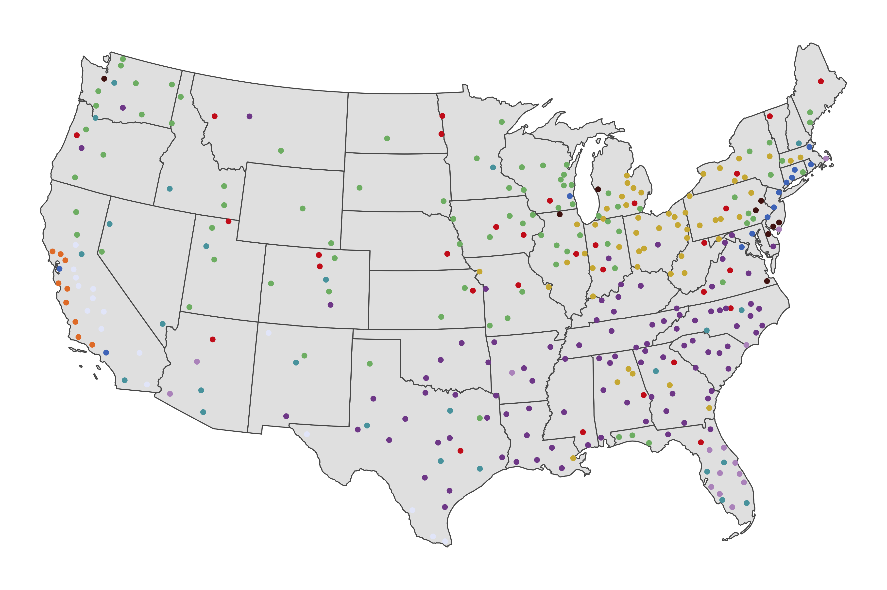

# Legacy Regions Research

This repository contains code, data, and analysis related to our research (conducted by myself &amp; [Dr. Ned Hill](http://glenn.osu.edu/faculty/glenn-faculty/hill/)) on legacy cities and what we call "legacy regions."

  

The core of this research is an analysis that combines cluster *and* discriminant analyses—which subsets a universe into distinct groupings and tests the statistical validity of those groupings (see [Hill et al., 1998](https://journals.sagepub.com/doi/10.1080/0042098983962))—to group every U.S. metropolitan area into clusters, each according to its profile of legacy assets and liabilities within their central city and overall regional economy. 

We use a mixture of asset variables and liability variables (as well as a few control variables) in our analysis. Our base dataset was constructed from a wide variety of sources, most of which are publicly available. The code used to clean and merge all of the variables in the dataset can be found within this repository:

* This [folder](https://github.com/andrewvanleuven/legacyR/tree/master/code/data_cleaning) contains `R` files which were used to clean the data in batches. Variables from common sources (e.g., the U.S. Census or Bureau of Transportation Statistics) were typically cleaned within the same `.R` script.
* The master dataset is easily interpreted with the help of the [codebook](code/data_cleaning/codebook.md), which describes each variable in terms of its meaning, source, and geography.
* The analysis was primarily conducted in the [clustr_discrim](code/analysis/clustr_discrim.R) script. This script contains the code used to group every metro area (cluster analysis) as well as the code used to interpret the clusters (discriminant analysis).
* This [folder](https://github.com/andrewvanleuven/legacyR/tree/master/plot) contains a variety of visualizations and maps pertaining to this project.

***

*See more at my personal [website](https://andrewvanleuven.com/).*

